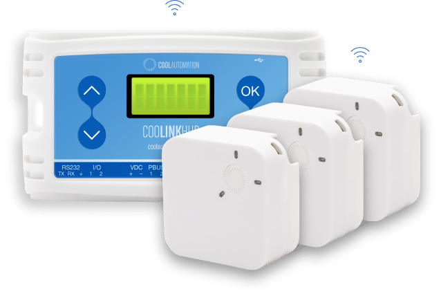

# homebridge-cool-automation

[](https://www.npmjs.com/package/homebridge-cool-automation)
[](https://www.npmjs.com/package/homebridge-cool-automation)
[](https://github.com/homebridge/homebridge/wiki/Verified-Plugins)


[Homebridge](https://github.com/nfarina/homebridge) plugin for Cool Automation - HVAC Systems Controller



### Requirements

 &nbsp;


check with: `node -v` & `homebridge -V` and update if needed

# Installation

<!-- This plugin is Homebridge verified and HOOBS certified and can be easily installed and configured through their UI. -->

The plugin can be easily installed configured via Homebridge UI.

Otherwise, follow these instructions

1. Install homebridge using: `sudo npm install -g homebridge --unsafe-perm`
2. Install this plugin using: `sudo npm install -g homebridge-cool-automation`
3. Update your configuration file. See `config-sample.json` in this repository for a sample.

\* install from git: `sudo npm install -g git+https://github.com/nitaybz/homebridge-cool-automation.git`


## Config file

#### Easy config (required):

``` json
"platforms": [
    {
        "platform": "CoolAutomation",
        "ip": "192.168.X.X"
    }
]
```

#### Advanced config (optional):

``` json
"platforms": [
    {
        "platform": "CoolAutomation",
        "ip": "192.168.X.X",
        "statePollingInterval": 30,
        "minTemperature": 16,
        "maxTemperature": 30,
        "coolMode": true,
        "heatMode": true,
        "autoMode": false,
        "fanMode": true,
        "dryMode": true,
        "vlowFspeed": false,
        "lowFspeed": true,
        "medFspeed": true,
        "highFspeed": true,
        "topFspeed": false,
        "autoFspeed": true,
        "debug": false
    }
]
```


### Configurations Table

|             Parameter            |                       Description                       | Required |  Default |   type   |
| -------------------------------- | ------------------------------------------------------- |:--------:|:--------:|:--------:|
| `platform`                       | always "cool-automation"                                |     ✓    |     -    |  String  |
| `ip`                             | IP Address of the CoolAutomation hub                    |     ✓    |     -    |  String  |
| `statePollingInterval`          | Time in seconds between each status polling of the Electra devices  |          |  `30` |  Integer |
| `minTemperature`               |  Minimum Temperature to show in HomeKit Control (supports fahrenheit)|          |  `16` |  Integer |
| `maxTemperature`               |  Maximum Temperature to show in HomeKit Control (supports fahrenheit)|          |  `30` |  Integer |
| `coolMode`                     |  Enable COOL mode control                                 |          |   true   |  Boolean |
| `heatMode`                     |  Enable HEAT mode control                                 |          |   true   |  Boolean |
| `autoMode`                     |  Enable AUTO mode control                                 |          |   true   |  Boolean |
| `fanMode`                      |  Enable FAN mode control - Adds extra fan accessory       |          |   true   |  Boolean |
| `dryMode`                   |  Enable DRY mode control - Adds extra dehumidifier accessory |          |   true   |  Boolean |
| `vlowFspeed`                   |  Support "Very-Low/Quite" fan speed                       |          |   true   |  Boolean |
| `lowFspeed`                    |  Support "Low" fan speed                                  |          |   true   |  Boolean |
| `medFspeed`                    |  Support "Medium" fan speed                               |          |   true   |  Boolean |
| `highFspeed`                   |  Support "High" fan speed                                 |          |   true   |  Boolean |
| `topFspeed`                    |  Support "Very-High/Top" fan speed                        |          |   true   |  Boolean |
| `autoFspeed`                   |  Support "Auto" fan speed                                 |          |   true   |  Boolean |
| `debug` |  When set to `true`, the plugin will produce extra logs for debugging purposes   |          |  `false` |  Boolean |

### Fan speeds & "AUTO" speed
Since HomeKit control over fan speed is with a slider between 0-100, the plugin converts the steps you have in the Electra app to values between 1 to 100, when 100 is highest and 1 is lowest. Setting the fan speed to 0, should actually set it to "AUTO" speed.

*Available fan speeds: AUTO, VLOW, LOW, MED, HIGH, TOP*<br>
*enable or disable them inside the config*


### Issues & Debug

If you experience any issues with the plugin please refer to the [Issues](https://github.com/nitaybz/homebridge-cool-automation/issues) tab and check if your issue is already described there, if it doesn't, please create a new issue with as much detailed information as you can give (logs are crucial).<br>

if you want to even speed up the process, you can add `"debug": true` to your config, which will give me more details on the logs and speed up fixing the issue.

-------------------------------------------

## Support homebridge-cool-automation

**homebridge-cool-automation** is a free plugin under the GNU license. it was developed as a contribution to the homebridge/hoobs community with lots of love and thoughts.
Creating and maintaining Homebridge plugins consume a lot of time and effort and if you would like to share your appreciation, feel free to "Star" or donate. 

<a target="blank" href="https://www.paypal.me/nitaybz"></a><br>
<a target="blank" href="https://www.patreon.com/nitaybz"></a><br>
<a target="blank" href="https://ko-fi.com/nitaybz"></a>